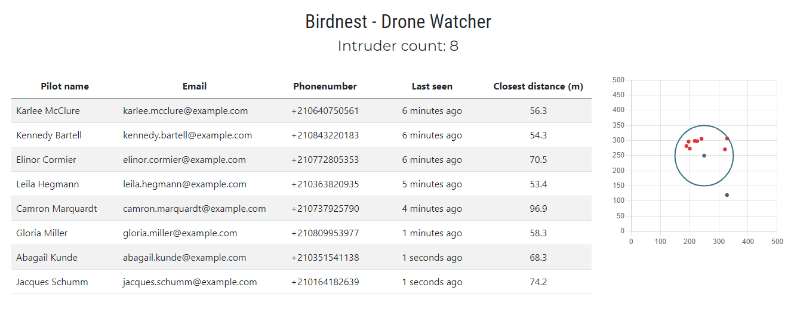

# Readme

This project is a pre-assignment for [Reaktor.com](https://www.reaktor.com/). More about the assignment [here](https://assignments.reaktor.com/birdnest).

Objective of the assignment was to build and deploy a web application which lists all the pilots who recently violated no drone zone perimeter.

# Technologies

I used React + vite for the frontend and node + express for the backend. I used [node-cache](https://www.npmjs.com/package/node-cache) to save the data as I didn't seem necessary to use external database for this purpose. Axios was used for the http requests.

# How it works

Application will fetch Reaktor's API for drone data and then it will check if the drones x y coordinates are inside of the NDZ. XML is returned from the API (/drones) that I have converted to JSON. Then it will query Reaktor's API (pilots/:sn) for pilot data.

Before it will cache the data. It will check if drone is already in the cache by searching it with the drones serial number. If record is found it will compare the new drone position and cached drone position to determine the closest distance to nest. It will also update the last seen field and refresh the TTL of the cache. 

If drone was not found in the cache, it will cache pilot information + drone data (for drones that are in NDZ) in memory cache under drones serial number as that is unique. It will not cache the drones that are not in the NDZ. Those are sent in the response.

# Demo

Available at [https://birdnest.lassesuomela.com](https://birdnest.lassesuomela.com)

# Endpoints

`GET /api/drones fetch` drones that are in NDZ with pilot information and fetch drones outside of the NDZ

# How to run

1. Clone the repository
2. `cd backend` to go to the backend directory
3. `npm i` to install dependencies
4. `npm run dev` to start nodemon on port 8080

5. `cd frontend` to go to the backend directory
6. `npm i` to install dependencies
7. `npm run dev` to start vite dev server on port 3000

# Screenshot

Here you can see my creation. On the right you can see a radar on where the drones were when they violated the NDZ perimeter as red dots. Gray dots are drones that not in the NDZ.

On the left you can see the list of pilots and their information.
